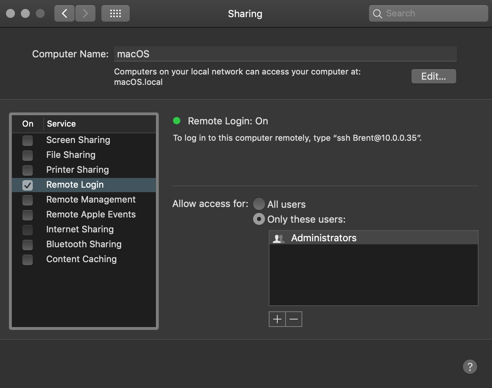

# How to set up secure SSH access to your personal laptop

## How to securly connect to your laptop at home via SSH using a remote VPN and using dynmaic DNS

## Table of contents

1. Enabling SSH access
2. Setting up a remote VPN
3. Setting up duck DNS on your laptop
4. configuring SSH access on your laptop

## Enabling SSH access on your macbook

### on your macbook

1. Open System Preferences
2. Sharing
3. Turn on "remote login"



#### Test it

see if you can ssh into yur machine from your phone or from the macbooks terminal itself. You will have to enter your user password.

```bash
# Enter whatever it says in the sharing panel
ssh Brent@10.0.0.35
```

This is should be working. This is good except for a few things. Disconnect for now.

### Security concerns

1. We've got port 22 open on our laptop which shows we have SSH access enabled to old asshole who scans the network. 666 is a better port. Besides no one plays network DOOM anymore. If you do than pick a more satanic port number and proceed with this guide.
2. Root users can login with a password. This means any old asshole can try to brute force your administrator password. Not only would they get local root login to your machine, they would have remote SSH root login to your machine as well.

### Some ways to make this a little more secure

1. Change the SSH port to 666 instead of 22 so that attackers will get distracted and try to play remote network DOOM.
2. Only allow access from a single IP address. We will configure a remote VPN server for this
4. Turn off root login, disallow passwords and set up s SSH key

## Create SSH keys for login

I'm going to assume you've already created SSH keys on your local machine. Like for using github or something. If you haven't Please check [this guide about how to do it](erver-setup-with-ubuntu-16-04#step-four-—-add-public-key-authentication-(recommended))

On the same machine you are logging into that you are on,. Open a new terminal tab and copy your SSH keys to the SSH server.

```bash
ssh-copy-id Brent@10.0.0.35
```

Enter your password and the keys will be copied over.

Now try to connect again. This time it will connect automatically without asking for a password.

```bash
ssh Brent@10.0.0.35
```

That's because it's using key pairs to validate you now. 

## Testing security and setting up a second client device

Now on your phone download a terminal or SSH client

try to connect to the SSH server on the same LAN

```
ssh Brent@10.0.0.35
```

Now it's not working at all. It's asking for a password but it's not working.


Managing SSH keys


## Configuring SSH on your macbook

1. Open `/private/etc/ssh/sshd_config` with your favorite editor

Edit and uncomment the following lines to:

```bash
#Port 22
Port 666

#PasswordAuthentication yes
PasswordAuthentication no

#PermitRootLogin prohibit-password
PermitRootLogin no

#PubkeyAuthentication yes
PubkeyAuthentication yes

```

Save the file, enter your password, and restart the computer


## References

- [How To Set Up an OpenVPN Server on Debian 10](https://www.digitalocean.com/community/tutorials/how-to-set-up-an-openvpn-server-on-debian-10)